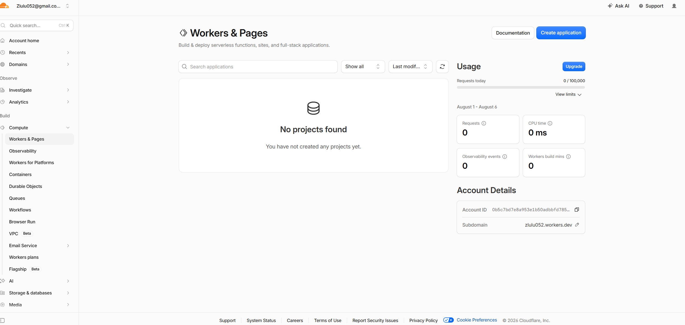
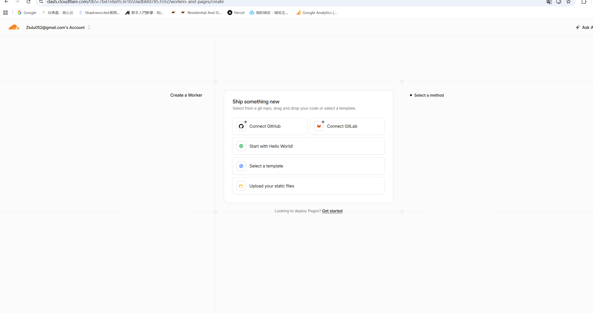
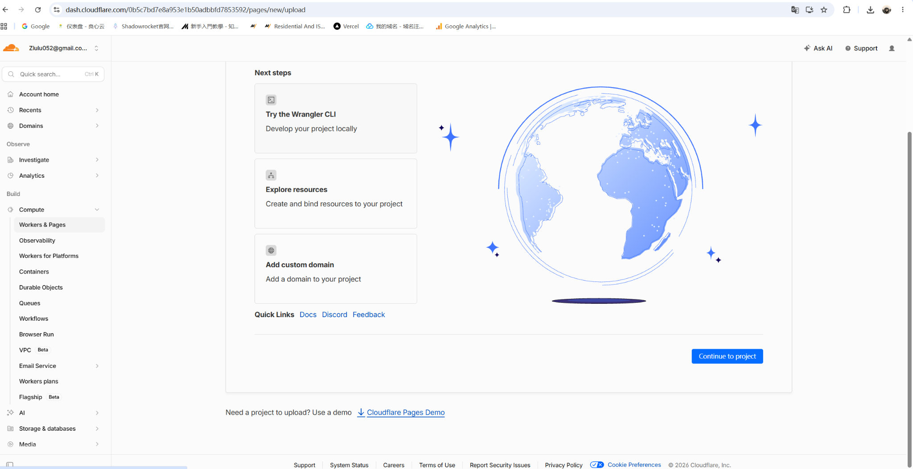
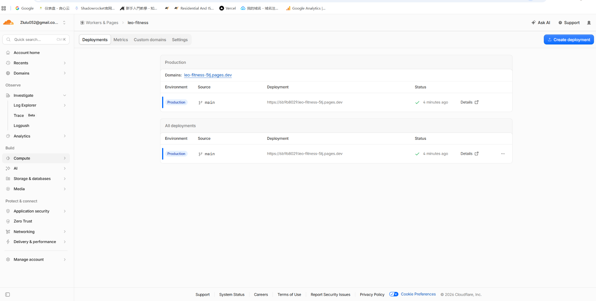
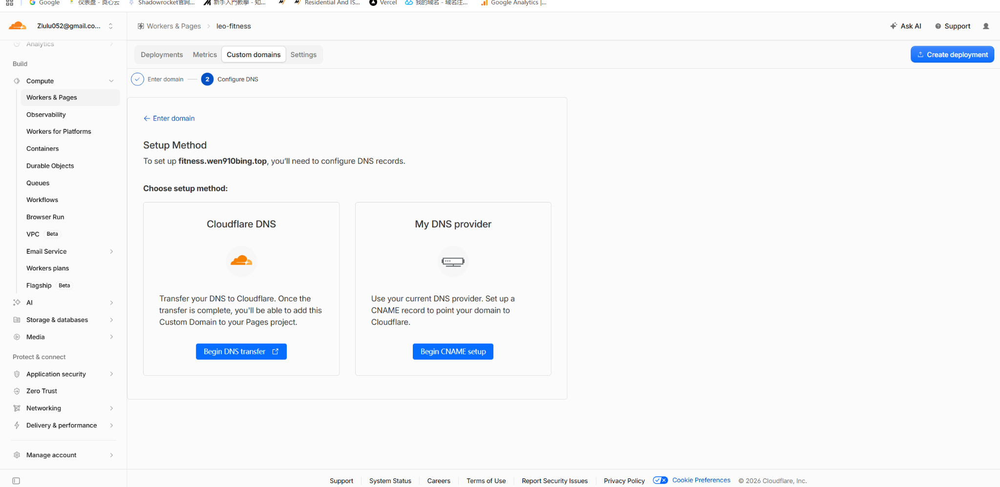
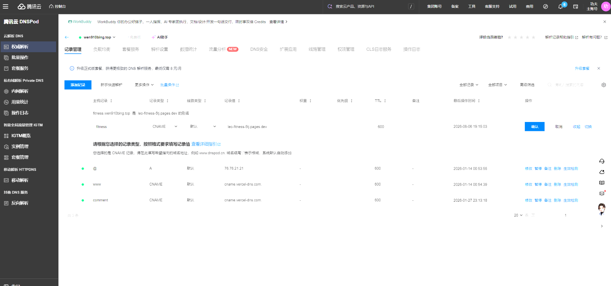

# 🏋️ [硬核实战] 我用 ChatGPT + Cloudflare Pages，亲手搓了一个私人健身 App

> 📢 **前言：** 一开始，我只是想让 AI 帮我安排一份居家哑铃训练和减脂饮食计划。
>
> 结果聊着聊着，训练计划变成了电子手册，电子手册又变成了离线网页，最后我干脆把它部署到了自己的二级域名：
>
> **https://fitness.wen910bing.top**
>
> 它不是什么商业项目，也没有复杂后台，但它真的能装进手机、记录数据、离线打开，而且完全按照我的身体情况和训练习惯定制。

---

## 🌈 01. 为什么要自己造一个健身 App？

市面上的健身软件很多，但我真正需要的东西其实非常简单：

1. 🏋️ **今天该练什么**：按“推、拉、腿肩核心、休息”循环。
2. 🔥 **训练前怎么热身**：不用每次翻聊天记录。
3. 🍱 **今天吃什么**：食材克数、具体做法、训练前后怎么吃。
4. ✍️ **记录训练数据**：重量、组数、次数、体重、腰围和睡眠。
5. 📈 **过一段时间能回看**：知道自己有没有进步，而不是凭感觉。
6. 📱 **手机上好操作**：打开就用，不想安装一个又大又复杂的软件。

我的目标不是做一个“功能最多”的 App，而是做一个**我真的愿意每天打开的工具**。

---

## 🧠 02. 先把需求喂给 AI

整个项目最关键的一步，不是写代码，而是先把需求一点点讲清楚。

最初的条件是：

| 项目 | 我的情况 |
|---|---|
| 身高 / 体重 | 172cm / 72kg |
| 训练经验 | 健身小白 |
| 训练场景 | 居家 |
| 器械 | 可调哑铃 + 哑铃凳 |
| 目标 | 减少腹部赘肉、增加全身肌肉线条 |
| 训练节奏 | 练三休一 |

经过几轮调整，最终训练框架稳定为：

```text
Day 1：推日（胸 + 肱三头肌）
Day 2：拉日（背 + 肱二头肌）
Day 3：腿 + 肩 + 核心
Day 4：休息
```

饮食则控制在：

```text
每日热量：1900–2100 kcal
每日蛋白质：130–150g
饮水：2.5–3L
```

然后我继续提出新需求：

> “把热身、训练计划、饮食都做进离线系统里供我查看。”

从这一句话开始，它不再只是一份计划，而是逐渐变成了一个产品。

---

## 🛠️ 03. 它最终能做什么？

目前的 LEO Fitness 包含五个核心页面：

| 页面 | 功能 |
|---|---|
| 首页 | 显示今日建议训练和近 7 天概览 |
| 训练 | 查看推、拉、腿肩核心热身与正式计划 |
| 饮食 | 极简早餐、一周菜谱、食材克数与做法 |
| 记录 | 填写体重、腰围、饮食、训练、睡眠 |
| 分析 | 查看趋势、训练次数、蛋白达标率与建议 |

最让我满意的不是页面有多炫，而是所有内容都来自我自己的计划。

它不是一个通用模板，而是一个真正围绕我设计的小工具。

---

## 🏗️ 04. 技术架构：没有服务器，也能跑起来

这个版本采用的是非常轻量的静态 PWA 架构：

```text
HTML + CSS + JavaScript
        │
        ├── manifest.json       负责“添加到主屏幕”
        ├── service-worker.js   负责离线缓存
        └── localStorage        保存个人记录
```

项目文件只有几个：

```text
LEO_Fitness_V3/
├── index.html
├── manifest.json
├── service-worker.js
├── icon.svg
└── README.txt
```

这里没有传统意义上的服务器和数据库。

每个人填写的数据，会保存在自己设备、自己浏览器的 `localStorage` 中。

这也意味着：

- 我的朋友打开同一个网址，不会看到我的记录；
- 朋友的数据不会污染我的数据；
- 换手机不会自动同步；
- 清除浏览器网站数据，记录可能会丢失；
- 因此系统加入了 JSON 导出和导入备份。

对于一个个人工具来说，这个方案足够轻、足够省钱，也足够隐私。

---

## ☁️ 05. 部署到 Cloudflare Pages

代码准备好之后，接下来就是把它变成一个真正能访问的网站。

我使用的是 **Cloudflare Pages**。

首先进入 Cloudflare 后台，在左侧找到：

```text
Compute
└── Workers & Pages
```



点击右上角创建应用后，新版 Cloudflare 会优先展示 Worker。

这时候要找到页面下方的 Pages 入口，或者选择上传静态文件。



把项目压缩包解压，确保 `index.html` 位于上传目录最外层，然后上传：

```text
index.html
manifest.json
service-worker.js
icon.svg
```

部署成功后，Cloudflare 会生成一个临时地址，例如：

```text
https://leo-fitness-5tj.pages.dev
```



到这里，一个完全免费的 HTTPS 健身网站就已经可以打开了。

---

## 🌐 06. 绑定自己的二级域名

我原来的博客地址是：

```text
https://www.wen910bing.top
```

为了不影响博客，我给健身系统单独使用一个二级域名：

```text
https://fitness.wen910bing.top
```

项目结构变成：

```text
www.wen910bing.top       → Vercel 上的 Hugo 博客
fitness.wen910bing.top   → Cloudflare Pages 健身系统
```

在 Cloudflare 项目中进入：

```text
Custom domains
→ Set up a custom domain
```



因为我的 DNS 在腾讯云 DNSPod，所以选择：

```text
My DNS provider
→ Begin CNAME setup
```



然后进入腾讯云 DNSPod，新增一条 CNAME：

| 配置项 | 内容 |
|---|---|
| 主机记录 | `fitness` |
| 记录类型 | `CNAME` |
| 线路类型 | 默认 |
| 记录值 | `leo-fitness-5tj.pages.dev` |
| TTL | 600 或默认 |



等待解析和 HTTPS 证书生效后，正式地址就可以访问了：

```text
https://fitness.wen910bing.top
```

---

## 📲 07. 把网页安装成手机 App

PWA 最有意思的地方，就是它明明是网页，却可以像 App 一样出现在桌面。

### iPhone

```text
Safari 打开网站
→ 分享
→ 添加到主屏幕
→ 添加
```

### Android

```text
Chrome 打开网站
→ 右上角菜单
→ 安装应用 / 添加到主屏幕
```

安装后，桌面会出现独立图标。

再次打开时，没有普通网页那种明显的地址栏，使用体验更像一个轻量 App。

---

## 🔐 08. 朋友使用，会不会把我的数据搞乱？

不会。

目前程序和数据是分开的：

```text
网站程序：所有访问者共用
个人记录：各自保存在各自浏览器
```

例如：

- 我在自己的手机记录 72kg；
- 朋友在他的手机记录 80kg；
- 两个人虽然访问同一个网址，但数据彼此独立。

只有在同一台设备、同一个浏览器用户环境中使用，才可能看到同一份本地记录。

这是一种很适合个人小工具的隔离方式。

---

## 👿 09. 我踩过的几个坑


### 🛑 坑一：临时域名和正式域名的数据不互通

`pages.dev` 和 `fitness.wen910bing.top` 是两个不同的网站来源。

因为数据保存在浏览器本地，所以在临时地址填写的记录，不会自动出现在正式域名中。

正式使用前，最好先把自定义域名绑定完成。

### 🛑 坑二：本地数据不是云同步

`localStorage` 很方便，但它不是数据库。

清缓存、换手机或换浏览器前，要记得导出备份。

---

## 🎉 10. 从一句需求，到一个真正能用的产品

这次最有意思的地方，不是我写出了多少代码，而是整个过程几乎都是从自然语言开始的。

我只是在不断告诉 AI：

```text
我有什么器械
我想练成什么样
我每天怎么吃
我希望系统记录什么
手机上哪里不好用
部署过程中卡在了哪一步
```

AI 根据我的反馈不断调整：

```text
训练计划
→ 饮食手册
→ 离线记录网页
→ 手机版底部导航
→ PWA
→ Cloudflare 部署
→ 自定义域名
```

它没有替我“一键完成所有事情”。

但它像一个随叫随到的产品经理、程序员和部署助手，把一个模糊的念头，逐步变成了一个可以真正使用的工具。

---

## 🚀 Next Step：把它升级成真正的私人教练

目前这个版本已经够我自己记录和回看，但下一步我还想加入：

- 🗄️ 登录账号与云端同步；
- 📊 自动生成周报和月报；
- 🏋️ 每个动作单独记录重量和次数；
- ⬆️ 自动判断下次是否该增加哑铃重量；
- 🍱 一键生成每周采购清单；
- 📷 体型照片时间轴；
- 🤖 根据体重、腰围、睡眠和力量表现给出调整建议。

现在它只是一个轻量健身记录器。

但只要继续迭代，它完全可以变成一个真正属于我的 AI 私人教练。

---

## ✨ 11. 项目地址

LEO Fitness：

**https://fitness.wen910bing.top**

我的博客：

**https://www.wen910bing.top**

---

> 代码只是工具，真正重要的是：你能不能把一个“我想要”的念头，持续拆成一个又一个可以完成的小步骤。

#ChatGPT #CloudflarePages #PWA #独立开发 #个人网站 #健身打卡
